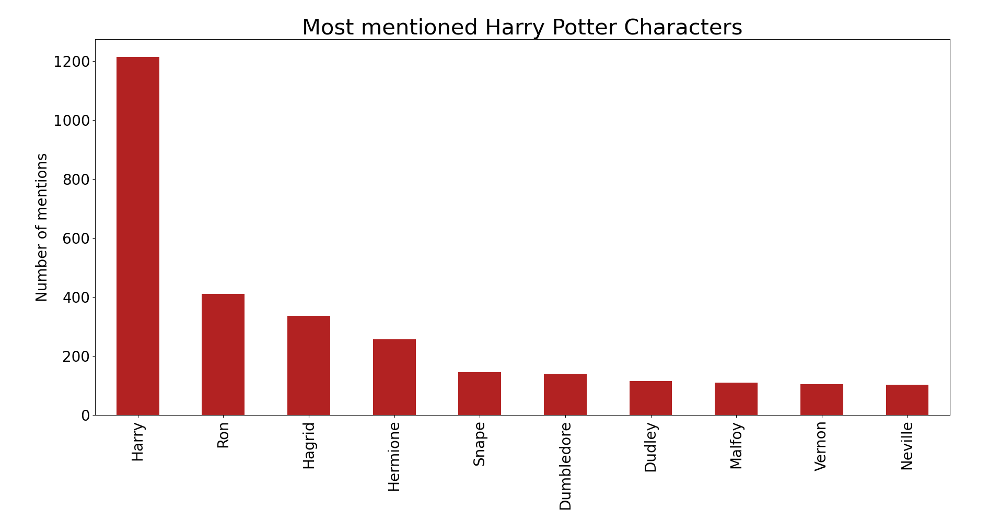
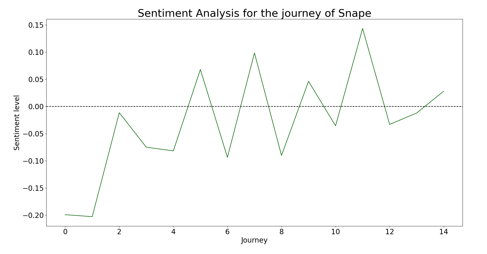
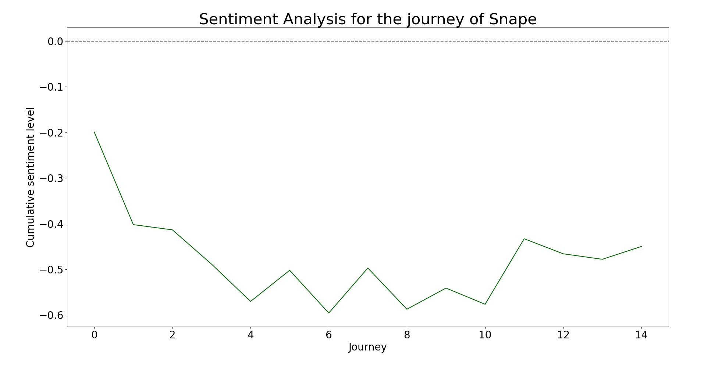

# Book Analysis: Project Overview  
* Text mining of Harry Potter book. 
* Functions to tokenize, manipulate text and build plots.
* Sentiment analysis. 

## Code and Resources Used
**Python Version:** 3.7   
**Packages:** nltk.tokenize, nltk.probability, nltk.corpus, nltk.tag, matplotlib, pandas, textblob  

## Tokenization
Splitted an entire text into small units, known as tokens. Created a list of all the words, sentences, paragraphs and chapters in the book.  

## Text mining
Explored the text to discover repetitive patterns that explain the behavior of the text. Used Frequency Distribution function from NLTK. Created a ranked list of words. Eliminated the common words (stop words). Selected proper nouns and ranked them. 

## Sentiment Analysis
Calculated sentiment polarity (textblob). The polarity for an element defines the orientation of the expressed sentiment, i.e., it determines if the text expresses the positive, negative or neutral sentiment of the user about the entity in consideration.  

# Harry Potter and the Philosopher's Stone

### Most mentioned characters
The ten most mentioned characters of Harry Potter and the Philosopher's stone were analyzed. As expected, the name Harry was the most mentioned one, a total of 1213 times. It was followed by Ron (410 times), Hagrid (336 times) and Hermiones (257 times).  

### Sentiment analysis for chapters
A sentiment analysis was applied on the book chapters. Numbers > 0 mean positive sentiment levels and numbers < 0, negative sentiment level. Chapter 3 was the only chapter with a negative sentiment level. In chapter 3, punished for the boa constrictor incident, Harry was locked alone in his cupboard until summer. In this chapter, Uncle Vernon prevented Harry from receiving Hogwarts' letter in many ways, even taking the family to an island on a stormy night, setting the scene in an atmosphere of mystery and terror.

### Sentiment analysis for Harry Potter
Each paragraph/sentence receives a sentiment level. The candidate is then given the sentiment score based on their average appearance in positive and negative paragraphs/sentences.
The sentiment level for Harry Potter was calculated based on his appareance on sentences and paragraphs.
Harry Potter received a high sentiment level showing his positivity along the book (sentences: 39.47, paragraphs: 34.02). The sentiment levels for either sentences or paragraphs showed similar results, demonstating that both entities of the book are quite good for the estimations.

### Sentiment analysis for Hogwarts Houses
Sentiment level for the four Hogwarts houses based on appareances in senteces was analyzed.   
For Hogwarts houses, Gryffindor got the highest sentiment level. Unexpectedly, Ravenclaw and Hufflepuff got lower sentiment levels than Slytherin. It was probably due to lower mentions in general along the book.

### Sentiment analysis for key characters
Sentiment level for the key characters based on appareances in paragraphs.
Heroes and villains of the story are shown in the barplot. But this is not quite true. Neville Longbottom received a negative score, almost equal as Draco Malfoy. The sentiment analysis also counts as negative feelings, nostalgia and sadness, not just badness.

### Character's sentiment journey across the book: SNAPE
The sentiment analysis was applied for a specific character. The book was splitted into a selected number of sections to display a chronological counter with its corresponding sentiment level. The sentiment level for each section of the journey across the book was also calculated cumulatively.
Snape's sentiment journey was almost around zero across the book. But cumulatively, Snape had negative sentiments in Harry Potter and the Philosopher's Stone. Remember that he quickly became the primary antagonist of this book, as Harry suspected him of plotting to steal the Philosopher's Stone, and of attempting to kill him.

